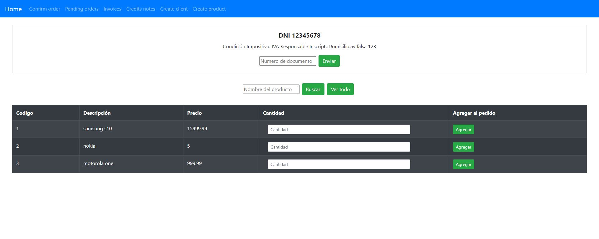

<!-- PROJECT LOGO -->
<br />
<p align="center">
  <a href="https://github.com/ttiago7/commerce-front">
    
  </a> 

  <h3 align="center">Commerce Client with React</h3>

  <p align="center">
    Project description: Commerce client is used to generate orders and invoices
    <br />
    <a href="https://github.com/ttiago7/commerce-front"><strong>Explore the docs »</strong></a>
    <br />
    <br />
    <a href="https://github.com/ttiago7/commerce">View Backend repo</a>
    ·
    <a href="https://github.com/ttiago7/commerce-front">View Frontend repo</a>
  </p>
</p>


<!-- TABLE OF CONTENTS -->
<details open="open">
  <summary><h2 style="display: inline-block">Table of Contents</h2></summary>
  <ol>
    <li>
      <a href="#built-with">Built With</a>      
    </li>
    <li>
      <a href="#getting-started">Getting Started</a>
      <ul>
        <li><a href="#prerequisites">Prerequisites</a></li>
        <li><a href="#installation">Installation</a></li>
      </ul>
    </li>
    <li><a href="#usage">Usage</a></li>
    <li><a href="#contact">Contact</a></li>
  </ol>
</details>


### Built With

* React
* Redux, redux-thunk
* Axios
* ducks
* bootstrap
* react-router-dom
* react-hook-form

<!-- GETTING STARTED -->
## Getting Started

Instructions on setting up this project locally. To get a local copy up and running follow these simple steps.

### Prerequisites

* Git
* NodeJS


### Installation

1. Run the backend, in this <a href="https://github.com/ttiago7/commerce">repo</a> you find the simple steps to up the Api rest
2. Clone the repo
   ```sh
   git clone https://github.com/ttiago7/commerce-front.git
   ```
2. Open the command line in this repo, into this execute next command
   ```sh
   npm install
   npm start
   ```


<!-- USAGE EXAMPLES -->
## Usage

1. In your browser open http://localhost:3000/ 
2. Generate and confirm orders to client

3. Invoicing all orders or cancel one
 
4. See the invoices and generate credit note

5. See the credits notes

6. the client allow create new client and product


<!-- CONTACT -->
## Contact

Calizaya Santiago - [@linkedin-ttiago7](https://www.linkedin.com/in/ttiago7/) - c.ttiago7@gmail.com
